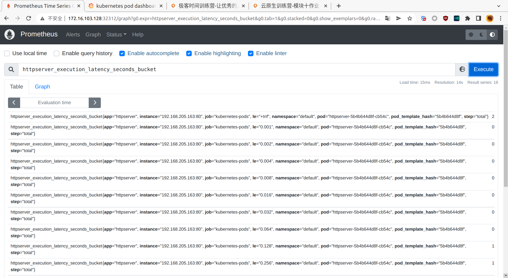
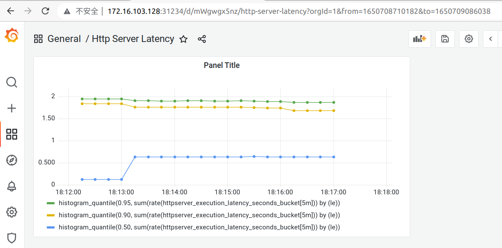

# 第十周作业

1. 为 HTTPServer 添加 0-2 秒的随机延时；
答：
   httpserver.go 用time.Sleep和rand.Intn实现随机延时
2. 为 HTTPServer 项目添加延时 Metric；
答：
   metric.go 参考孟老师的代码
3. 将 HTTPServer 部署至测试集群，并完成 Prometheus 配置；
答：
   deployment.yaml httpserver-svc.yaml myenv.yaml
4. 从 Promethus 界面中查询延时指标数据；
答：
   
5. （可选）创建一个 Grafana Dashboard 展现延时分配情况。
答：
   httpserver-latency.json
   