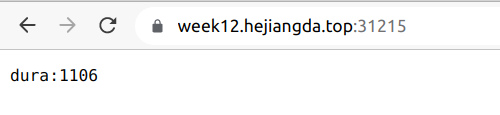
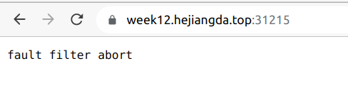

# 第十二周作业

把我们的 httpserver 服务以 Istio Ingress Gateway 的形式发布出来。以下是你需要考虑的几点：

1. 装istio
2. 创建一个新的namespace week12
3. 在week12下部署httpserver
4. 配证书
5. 创建gateway
6. 创建virtual service

- 如何实现安全保证；
  - 配证书，开启https，见istio/https-cert.yaml
- 七层路由规则；
  - 配virtual service 见istio/virtual-service.yaml
- 考虑 open tracing 的接入。
  - grafana
- 故障注入
  - 开启故障注入，见istio/fault.yaml
  - 
